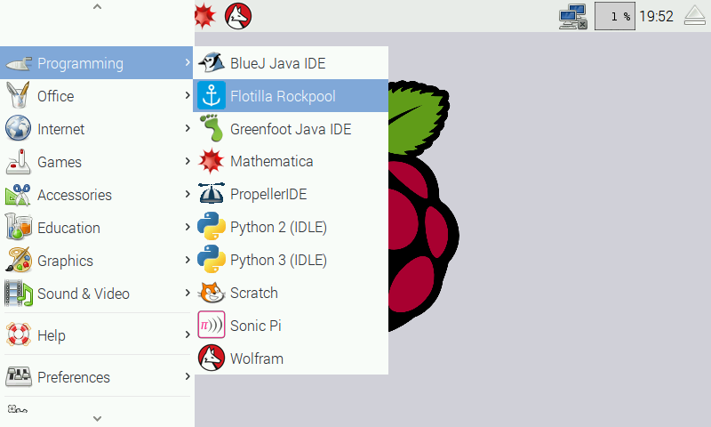

#Flotilla

##Installing

Just run:

```bash
sudo ./install
```

Flotilla Daemon will install and autostart by default.

##Rockpool

You'll find "Flotilla Rockpool" in the Pi menu under "Programming". It'll fire up your web-browser with the Rockpool flow interface.



##Advanced / Python API

If you want to use the Python API you'll first have to stop Flotilla glomming onto all the available Docks. You can do this by stopping the service like so:

```bash
sudo service flotillad stop
```

If you want to start it up again, just type:

```bash
sudo service flotillad start
```
